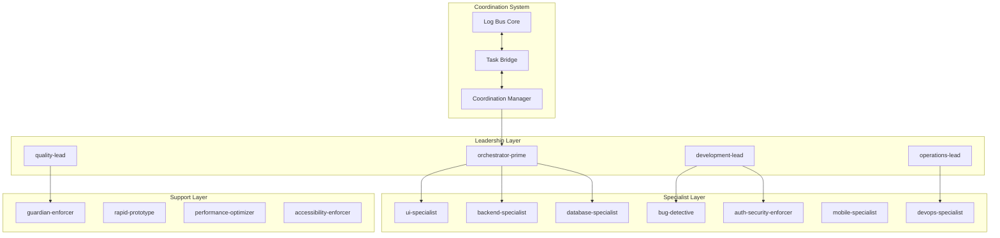
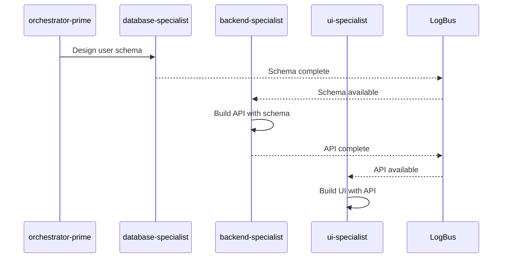
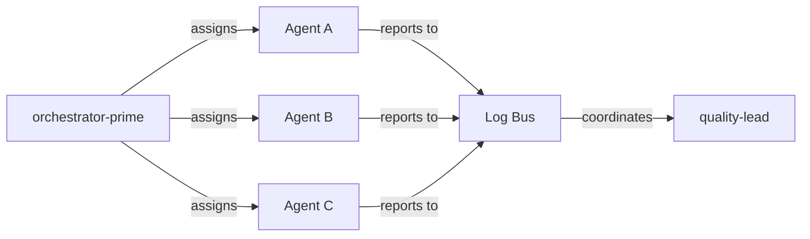
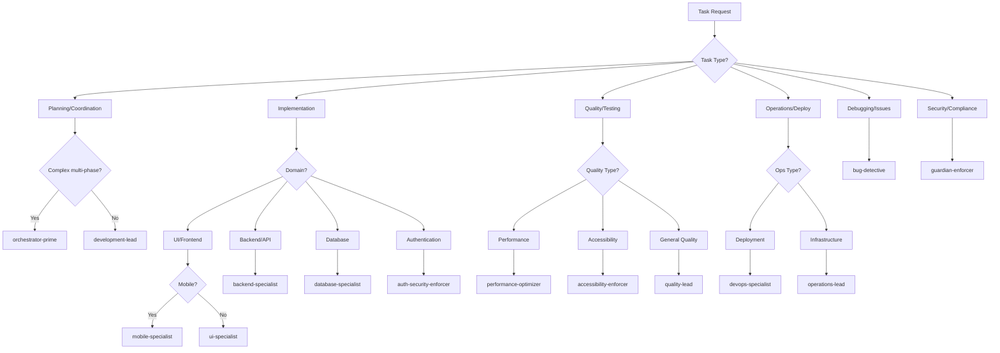

# Ultimate AI Agent System 🤖

## Overview

The Ultimate Monorepo includes 15 specialized AI agents with real-time coordination capabilities, combining the best features from previous iterations with enhanced coordination and security.

## 🏗️ Agent Architecture



## 🎯 Agent Capability Matrix

### Core Development Capabilities

| Agent | Code | Review | Debug | Deploy | UI/UX | API | DB | Security | Test | Plan |
|-------|------|--------|-------|--------|-------|-----|----|---------|----- |----- |
| **orchestrator-prime** | ❌ | ❌ | ❌ | ❌ | ❌ | ❌ | ❌ | ✅ | ❌ | ✅✅✅ |
| **development-lead** | ✅ | ✅✅ | ✅ | ❌ | ✅ | ✅ | ✅ | ✅ | ✅ | ✅✅ |
| **operations-lead** | ❌ | ❌ | ✅ | ✅✅✅ | ❌ | ❌ | ✅ | ✅✅ | ✅ | ✅ |
| **quality-lead** | ❌ | ✅✅✅ | ✅ | ❌ | ✅ | ✅ | ❌ | ✅✅ | ✅✅✅ | ✅ |
| **ui-specialist** | ✅✅✅ | ✅ | ✅ | ❌ | ✅✅✅ | ❌ | ❌ | ✅ | ✅ | ❌ |
| **backend-specialist** | ✅✅✅ | ✅ | ✅ | ❌ | ❌ | ✅✅✅ | ✅ | ✅✅ | ✅ | ❌ |
| **database-specialist** | ✅✅ | ✅ | ✅ | ❌ | ❌ | ✅ | ✅✅✅ | ✅ | ✅ | ❌ |
| **bug-detective** | ❌ | ✅✅ | ✅✅✅ | ❌ | ✅ | ✅ | ✅ | ✅ | ✅✅ | ❌ |
| **auth-security-enforcer** | ✅✅ | ✅✅ | ✅ | ❌ | ✅ | ✅✅ | ✅ | ✅✅✅ | ✅✅ | ❌ |
| **mobile-specialist** | ✅✅✅ | ✅ | ✅ | ❌ | ✅✅✅ | ✅ | ❌ | ✅ | ✅ | ❌ |
| **devops-specialist** | ✅ | ❌ | ✅ | ✅✅✅ | ❌ | ✅ | ✅ | ✅✅ | ✅ | ✅ |
| **guardian-enforcer** | ❌ | ✅✅✅ | ❌ | ✅ | ❌ | ❌ | ❌ | ✅✅✅ | ❌ | ✅ |
| **rapid-prototype** | ✅✅ | ❌ | ❌ | ❌ | ✅✅ | ✅✅ | ✅ | ❌ | ❌ | ❌ |
| **performance-optimizer** | ✅ | ✅ | ✅✅ | ❌ | ✅ | ✅✅ | ✅✅ | ❌ | ✅ | ❌ |
| **accessibility-enforcer** | ✅ | ✅✅ | ✅ | ❌ | ✅✅✅ | ❌ | ❌ | ❌ | ✅✅ | ❌ |

**Legend**: ❌ = Not capable | ✅ = Basic | ✅✅ = Proficient | ✅✅✅ = Expert

### Specialized Skills Matrix

| Agent | A11y | Perf | Arch | Docs | Auto | Mobile | K8s | Cloud |
|-------|------|------|------|------|------|--------|-----|-------|
| **orchestrator-prime** | ❌ | ✅ | ✅✅✅ | ✅ | ✅✅ | ❌ | ❌ | ❌ |
| **development-lead** | ✅ | ✅✅ | ✅✅ | ✅ | ✅ | ✅ | ❌ | ❌ |
| **operations-lead** | ❌ | ✅✅✅ | ✅ | ✅ | ✅✅✅ | ❌ | ✅✅✅ | ✅✅✅ |
| **quality-lead** | ✅✅ | ✅✅ | ✅ | ✅✅ | ✅✅ | ❌ | ❌ | ❌ |
| **ui-specialist** | ✅✅✅ | ✅✅ | ✅ | ✅ | ❌ | ✅ | ❌ | ❌ |
| **backend-specialist** | ❌ | ✅✅✅ | ✅✅ | ✅ | ✅ | ❌ | ❌ | ✅ |
| **database-specialist** | ❌ | ✅✅✅ | ✅✅ | ✅ | ✅ | ❌ | ❌ | ✅ |
| **bug-detective** | ✅ | ✅✅✅ | ✅ | ✅ | ✅ | ✅ | ✅ | ✅ |
| **auth-security-enforcer** | ✅✅ | ✅ | ✅✅ | ✅✅ | ✅ | ✅ | ✅ | ✅✅ |
| **mobile-specialist** | ✅✅ | ✅✅ | ✅ | ✅ | ❌ | ✅✅✅ | ❌ | ❌ |
| **devops-specialist** | ❌ | ✅✅ | ✅✅ | ✅ | ✅✅✅ | ❌ | ✅✅✅ | ✅✅✅ |
| **guardian-enforcer** | ✅✅ | ✅ | ✅✅ | ✅✅ | ✅ | ✅ | ✅ | ✅ |
| **rapid-prototype** | ✅ | ✅ | ❌ | ❌ | ❌ | ✅✅ | ❌ | ❌ |
| **performance-optimizer** | ✅ | ✅✅✅ | ✅✅ | ✅ | ✅ | ✅ | ✅ | ✅✅ |
| **accessibility-enforcer** | ✅✅✅ | ✅ | ✅ | ✅✅ | ❌ | ✅✅ | ❌ | ❌ |

## 🚀 Agent Coordination System

### Real-time Communication
Agents communicate through an intelligent log bus system that enables:

- **Dependency Resolution**: Agents automatically wait for prerequisite work
- **Context Sharing**: Relevant information flows between related agents  
- **Parallel Execution**: Independent tasks run simultaneously
- **Conflict Prevention**: Resource locks prevent simultaneous file modifications

### Coordination Patterns

#### Sequential Dependencies


#### Parallel Coordination


## 🎯 Decision Tree for Agent Selection

### Start Here: What do you need?



## 🛠️ Usage Examples

### Example 1: Full-Stack E-commerce Feature
```bash
# Orchestrator coordinates the entire flow
./tools/agent-orchestrate "implement secure shopping cart with payment processing"

# Automatic coordination:
# 1. orchestrator-prime → plans feature architecture
# 2. guardian-enforcer → validates security requirements  
# 3. database-specialist → designs cart/payment schema
# 4. auth-security-enforcer → implements secure payment flow
# 5. backend-specialist → builds cart API
# 6. ui-specialist → creates cart interface
# 7. mobile-specialist → adds mobile cart support
# 8. performance-optimizer → optimizes for scale
# 9. quality-lead → comprehensive testing
# 10. devops-specialist → deployment pipeline
```

### Example 2: Mobile App Development
```bash
# Mobile specialist coordinates with UI and backend
./tools/agent-orchestrate "create React Native app with offline sync"

# Coordination flow:
# mobile-specialist → leads mobile development
# ui-specialist → shares component patterns
# backend-specialist → designs sync API
# database-specialist → offline-first schema
# performance-optimizer → mobile performance tuning
```

### Example 3: Security Audit
```bash
# Guardian enforcer leads security review
./tools/agent-orchestrate "comprehensive security audit of authentication system"

# Security-focused coordination:
# guardian-enforcer → leads security audit
# auth-security-enforcer → reviews auth implementation
# backend-specialist → validates API security
# database-specialist → checks data protection
# devops-specialist → reviews infrastructure security
```

### Example 4: Performance Optimization
```bash
# Performance optimizer coordinates optimization efforts
./tools/agent-orchestrate "optimize application performance for 10x scale"

# Performance coordination:
# performance-optimizer → leads optimization effort
# database-specialist → query optimization
# backend-specialist → API performance tuning
# ui-specialist → frontend optimization
# devops-specialist → infrastructure scaling
```

## 🔧 Configuration and Customization

### Agent Resource Limits
Configure in `.claude/config/limits.yaml`:

```yaml
limits:
  execution:
    max_parallel_agents: 8
    max_task_duration_ms: 300000
    
  coordination:
    max_coordination_depth: 5
    coordination_timeout_ms: 60000
    enable_parallel_coordination: true
```

### Custom Agent Creation
1. Copy agent template: `cp .claude/agents/template.md .claude/agents/my-agent.md`
2. Define capabilities and tools
3. Add to coordination system
4. Update capability matrix

### Agent Communication Protocols
Agents communicate using structured messages:

```json
{
  "topic": "task_completion",
  "agent": "database-specialist",
  "task_id": "uuid-here",
  "deliverables": ["user_schema", "session_schema"],
  "next_agents": ["backend-specialist"],
  "context": {
    "schema_location": "/packages/types/src/user.ts",
    "migration_files": ["/migrations/001_users.sql"]
  }
}
```

## 📊 Monitoring and Metrics

### Agent Performance Dashboard
Monitor agent performance in Grafana:
- Task completion rates
- Average execution times  
- Error rates and types
- Coordination efficiency metrics
- Resource utilization

### Health Checks
```bash
# Check all agents
./tools/agent-monitor health

# Check specific agent
./tools/agent-monitor health ui-specialist

# View coordination logs
./tools/agent-monitor coordination-logs --agent orchestrator-prime
```

### Audit Trail
All agent activities are logged for:
- Security compliance
- Performance analysis
- Debugging coordination issues
- Cost optimization

## 🚨 Troubleshooting

### Agent Not Responding
1. Check log bus status: `./tools/agent-monitor log-bus-status`
2. Verify agent configuration: `./tools/agent-monitor validate-config`
3. Check resource limits: `cat .claude/audit/performance-metrics.ndjson`

### Coordination Issues  
1. Check coordination logs: `grep coordination .claude/logs/*.ndjson`
2. Verify dependencies: `./tools/agent-monitor dependencies`
3. Reset coordination state: `./tools/agent-monitor reset-coordination`

### Performance Issues
1. Monitor resource usage: `./tools/agent-monitor resources`
2. Check parallel execution: `./tools/agent-monitor parallel-status` 
3. Optimize agent assignment: `./tools/agent-monitor optimize`

## 🔮 Future Enhancements

### Planned Features
- [ ] Machine learning for optimal agent assignment
- [ ] WebSocket real-time coordination updates
- [ ] Cross-project agent coordination
- [ ] Advanced dependency graph visualization
- [ ] Agent skill evolution and learning

### Extensibility
The agent system is designed for easy extension:
- Plugin architecture for new agents
- Configurable coordination patterns
- Custom tool integrations
- Multi-tenant agent isolation

---

**The Ultimate Agent System provides unprecedented development velocity through intelligent coordination and specialized expertise.** 🚀